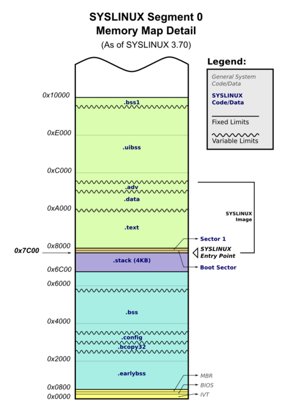

# 멀티스레드 정리

1. ref, future-promise, packaged_task, async의 속도 차이는 없다.
	- single_sum(): 5.506ms   
	multi_sum(): 1.81593ms   
	multi_sum_pf(): 1.82033ms   
	multi_sum_pkt(): 1.87113ms   
	multi_sum_async(): 1.8104ms
	- async는 스레드풀을 쓴다는 말이 있던데 위의 결과처럼 더 빠르게 나오진 않았다.

2. 지역 변수로 합을 구하고 ref에 한 번에 값을 넘기는 것과 ref에 계속 값을 더하는 것의 속도 차이는 꽤 심하다. (임계 영역이랑 별개로)
	- single_sum(): 5.519ms   
	multi_sum1(): 1.8216ms   
	multi_sum2(): 8.3963ms
	- 임계 영역이 전혀 없는 코드이고, 후자의 경우엔 싱글 코어보다 느린 것을 확인할 수 있다. 
	- 물론 연산 자체가 매우 단순해서 더 복잡한 연산을 가지고 컴파일러 최적화를 켜서 실행하면 달라질지도 모른다.

3. atomic은 임계 영역이 아예 없는 코드만큼 빠르지는 않다. 하지만 mutex로 직접 락을 거는 것보다는 빠르다.
	- single_sum(): 5.5009ms   
	multi_sum(): 1.8904ms   
	multi_sum_atomic(): 75.8476ms   
	multi_sum_mutex(): 221.948ms

4. atomic의 memory_order의 경우, atomic변수를 하나만 쓸 때는 속도 차이가 없다.
	- multi_sum_atomic_relaxed(): 76.0443ms   
	multi_sum_atomic_seq_cst(): 77.9324ms
	- 여러 개의 atomic 변수를 사용해야 서로간의 memory_order가 적용되어 유의미해지는 것 같다.

---

## c++ 새로 알게 된 문법

[Generalized lambda capture in C++14](https://stackoverflow.com/questions/8640393/move-capture-in-lambda)

---

리눅스 메모리 맵 디테일   
   
cpu스택은 램에 있는 거였음

---

## 궁금한 점
1. 동적 할당을 하면 힙에 할당된다는데 힙은 프로세스별로 크기가 정해져있는건가? 크기가 정해져있으면 그게 동적 할당이 맞나? 그러면 램을 10기가씩 넘게 먹는 프로그램은 어떻게 된건지?

2. c/c++은 동적 할당을 자주하면 메모리 단편화가 일어난다고 하는데 메모리 단편화는 os가 해결해야 하는 문제 아닌가?

3. 함수 호출할 때 시스템 스택을 사용하는데, 그러면 메모리에 있는 스택 영역은 시스템 스택이랑 호환 용도로 있는건가? 

4. 커널 스택 vs 유저 스택 vs 시스템 스택 ?

5. 콘텍스트 스위치를 할 때 인터럽트가 들어가고 pcb에 정보를 저장하는 것 까진 알겠음. 근데 일단 진행중인 프로세스에 어떻게 인터럽트가 들어가는지 모르겠음. cpu는 들어오는 명령을 계속 실행할 뿐이고 어셈블리 코드에 인터럽트가 포함되어 있어야 하는거 아닌가? 그리고 심지어 x86에 int라는 명령으로 인터럽트가 있던데 cpu명령이 어떻게 커널에 정보를 전달하는건지 모르겠음. 커널도 결국엔 소프트웨어인데 cpu가 커널을 위한 명령을 가지고 있다니... 운영체제회사랑 cpu회사가 합을 맞춘건가?  
인터럽트 벡터 테이블(Interrupt Vector Table)이랑 인터럽트 처리 전용 칩으로 어떻게 처리를 하는 것 같긴 함. 좀 더 찾아봐야 할 듯