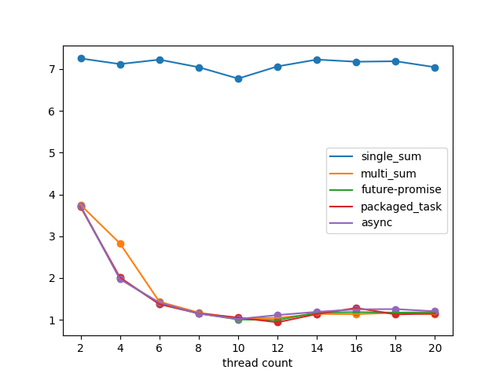

# 빅데이터처리 과제

### 22101200 이병윤

### 1. 메서드에 따른 속도 차이

c++에서 제공하는 비동기 처리 메서드에 따라 속도가 조금씩 달라질까 궁금해 테스트해보았다. 아래 5가지를 비교할 것이다.

- 싱글 스레드 덧셈
- int 배열에 각 스레드 결과 저장 후 합치기
- std::future / std::promise
- std::packaged_task
- std::async

모든 결과는 각 10번씩 실행해 구한 평균값이다.

| thread count | single_sum | multi_sum | future-promise | packaged_task | async    |
|--------------|------------|-----------|----------------|---------------|----------|
| 2            | 7.1823ms   | 3.7434ms  | 3.7596ms       | 4.321ms       | 3.8103ms |
| 4            | 7.0486ms   | 2.0129ms  | 1.9562ms       | 1.939ms       | 1.9695ms |
| 6            | 6.9657ms   | 1.4529ms  | 1.395ms        | 1.3856ms      | 1.4178ms |
| 8            | 7.1957ms   | 1.2202ms  | 1.1814ms       | 1.1963ms      | 1.1947ms |
| 10           | 7.2506ms   | 2.5655ms  | 1.461ms        | 1.0253ms      | 1.0185ms |
| 12           | 7.1362ms   | 0.9624ms  | 1.0763ms       | 0.9448ms      | 0.9325ms |
| 14           | 7.1015ms   | 1.221ms   | 1.1297ms       | 1.1984ms      | 1.2151ms |
| 16           | 7.1231ms   | 1.1896ms  | 1.1576ms       | 1.2134ms      | 1.1888ms |
| 18           | 7.6013ms   | 1.2603ms  | 1.1606ms       | 1.1898ms      | 1.1813ms |
| 20           | 7.2845ms   | 1.1339ms  | 1.2049ms       | 1.1471ms      | 1.1922ms |

확실히 싱글 스레드보다는 빠르고, 스레드 개수가 2 ~ 10으로 증가함에 따라 속도도 증가하는 것을 확인할 수 있다. 스레드 개수가 10개 이상일때 가장 빠른 모습을 보여준다. 

i5 cpu를 사용하고 있어서     

사실 첫 번째 방법을 제외하고는 모두 각 결과를 저장하고 합치는 방법이라 어느정도 예상된 결과였다. 그래도 코드가 조금씩 달라서 어느정도 속도 차이가 있지 않을까 싶었지만 거의 같다고 봐도 무방할 것 같다.

### 2. 임계 영역 처리 방식에 따른 속도 차이