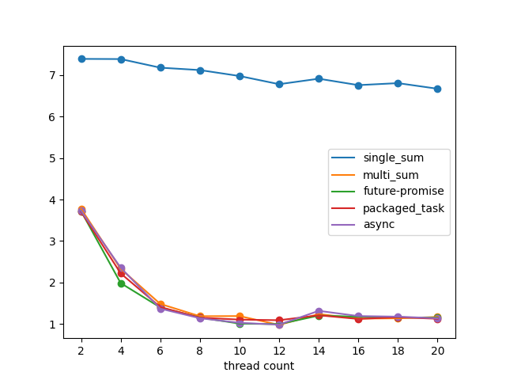

# 빅데이터처리 과제

### 22101200 이병윤

### 1. 메서드에 따른 속도 차이

먼저 c++에서 제공하는 비동기 처리 메서드에 따라 속도가 달라지는지 아래 5가지를 비교해보겠습니다. 모두 똑같이 thread 기반이고 결괏값을 전달하는 방법만 약간 다릅니다.

- 싱글 스레드 덧셈
- int 배열에 각 스레드 결과 저장 후 합치기
- std::future / std::promise
- std::packaged_task (future-promise 패턴 wrapper)
- std::async (packaged_task + 알아서 스레드 생성)

모든 결과는 각각 10번씩 실행해 구한 평균값입니다.

| thread count | single_sum | multi_sum | future-promise | packaged_task | async    |
|--------------|------------|-----------|----------------|---------------|----------|
| 2            | 7.3887ms   | 3.7769ms  | 3.7216ms       | 3.7061ms      | 3.7268ms |
| 4            | 7.385ms    | 2.3302ms  | 1.9868ms       | 2.2213ms      | 2.3591ms |
| 6            | 7.1774ms   | 1.485ms   | 1.4003ms       | 1.4097ms      | 1.3709ms |
| 8            | 7.1195ms   | 1.1892ms  | 1.1564ms       | 1.1539ms      | 1.1407ms |
| 10           | 6.9764ms   | 1.1927ms  | 1.0107ms       | 1.1076ms      | 1.0297ms |
| 12           | 6.7794ms   | 0.9797ms  | 0.9985ms       | 1.0927ms      | 0.9858ms |
| 14           | 6.9114ms   | 1.2404ms  | 1.2044ms       | 1.2111ms      | 1.3186ms |
| 16           | 6.7569ms   | 1.1323ms  | 1.1768ms       | 1.1235ms      | 1.1929ms |
| 18           | 6.8048ms   | 1.1383ms  | 1.1607ms       | 1.1655ms      | 1.1784ms |
| 20           | 6.6697ms   | 1.1707ms  | 1.1523ms       | 1.127ms       | 1.1395ms |

확실히 싱글 스레드보다는 빠르고, 스레드 개수가 2 ~ 10으로 증가함에 따라 실행 시간도 함께 감소하는 것을 확인할 수 있습니다.   
i5 cpu를 사용하고 있어서 코어가 6개이고, 논리 코어는 12개라 이론상 12개가 가장 빠른데, 맞게 결과가 나온 것 같습니다.

thread를 먼저 detach하고 나중에 future로 기다리는 방법과 thread자체를 join으로 기다리는 방법 2가지로 흐름이 조금 다르긴 했지만 큰 의미를 가지지 않았던 것 같습니다. 서로간의 속도 차이는 없었습니다.

### 2. 임계 영역 처리 방식에 따른 속도 차이

임계 영역을 만들지 않고, 지역 변수로 합을 구하고 값을 한번에 넘기는 방식으로는 어떤 메서드를 사용하던 속도의 차이가 보이지 않았습니다. 따라서 이번엔 합을 구하는 부분에 임계 영역을 삽입하고, lock의 종류에 따른 속도 차이를 보겠습니다.

abql

tas

ttas